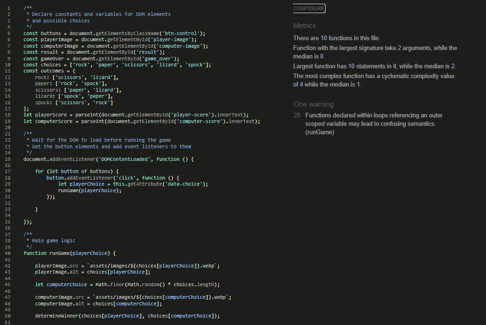
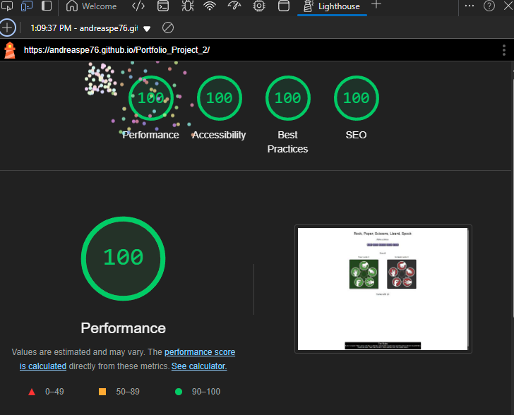

# Ultimate Rock, scissors, paper, lizard, Spock game 

Ultimate Rock, scissors, paper, lizard, Spock, is a game designed for adults and children alike, 
to help them make decisions and have fun against an opponent who makes a truly random choices.
The game is based on the classic rock, paper scissors game, but "enhanced" based on the expanded rules 
introduced by the popular "The Big Bang Theory" sitcom during episode 8 of season 2. 

## Features

- __Header__

- The header presents the title of the game, with a cartoonish font to make it playfull.

- __Game Options__

- The game options include a clear instruction and then a choice of options to choose from: Rock, Paper, Scissors, Lizard, Spock. 
  The choices are buttons the player can click to make their choice.

- __Game Result__

- When the player makes a choice, a corresponding image is shown on their side of the game board.
- Then Javascript makes a random choice for the computer player, displays a corresponding image on the computer player's side of the game board,
  and decides who the winner is.
- The winner is announced under the choice buttons, and the score of the player or the computer is updated according to who won.
- The score and the result is clear to the user, making it easy to understand who won and what the current score standings are.

- __The Footer__

- The footer consists of the rules of the game.
- The footer makes it easy for the player to understand the relations between the various choices presented to them.

- __Future features to implement__

- I would like to add the ability for the game to end after 10 rounds.
- I would also like to add a button so that the player can reset the score and the game board and restart the game.

## Bugs

- __Solved bugs__

- __Unfixed bugs__

- There are no known unfixed bugs.

## HTML, CSS, JavaScript validation & testing

- __HTML__

- The HTML code was validated using the official W3C validator with no errors.

- __CSS__

- The CSS code was validated using the official Jigsaw validator with no errors.

- __JavaScript__

- The JavaScript code was validated using the Jshint validator with no errors.

- __Testing__

- The game was tested using both desktop and mobile devices.
- I have confirmed that the results are always coorect.
- I have confirmed that the accessibility, readability and performance of the game in both desktop and mobile devices is good, 
  using the lighthouse dev tools.

## Deployment

- The site was deployed to GitHub pages. The steps to deploy are the following:
   - In the GitHub repository, navigate to the Settings tab.
   - From the source section drop-down menu, select the Master Branch.
   - Once the master branch has been selected, the page will be automatically refreshed with a detailed ribbon display to indicate the successful deployment.

The live link can be found here - https://andreaspe76.github.io/Portfolio_Project_2/

## Credits 

### Content 

- The idea for the layout of the game was taken from the Code Institute game proposal for portfolio project 2.
- The idea to add the lizard & Spock choices was taken from the "The Big Bang Theory" sitcom.

### Media

- The photos used on the game, were found with a web search and fall under the free to use and share license.

